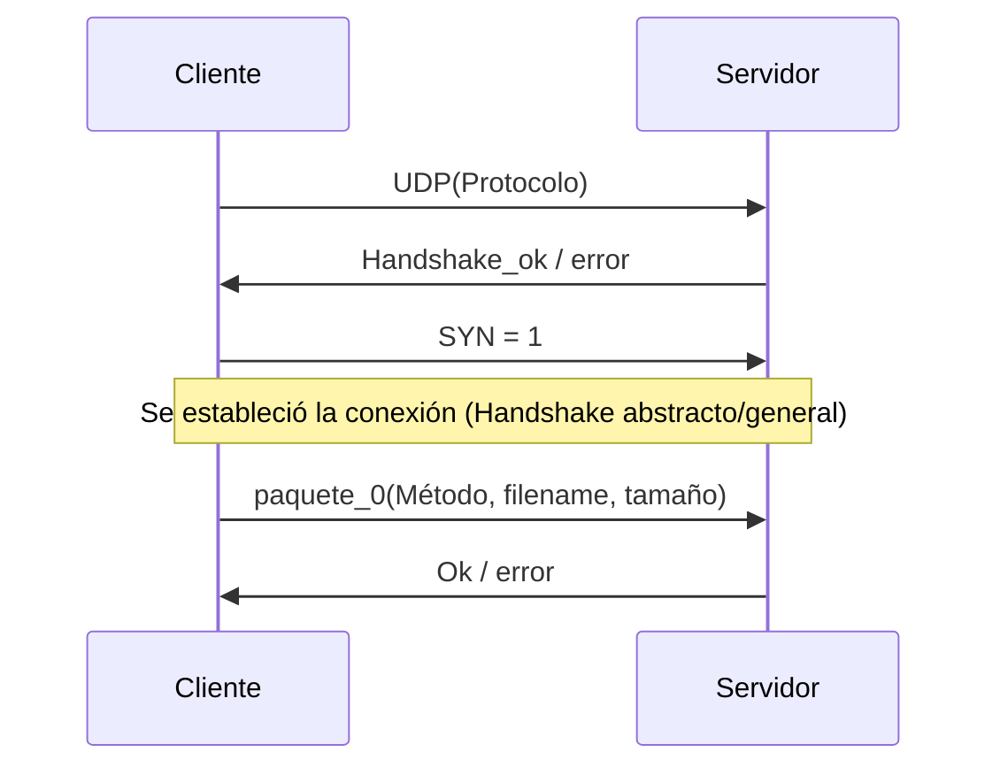
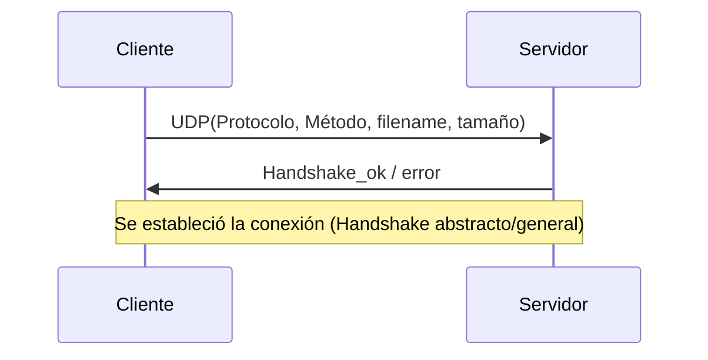
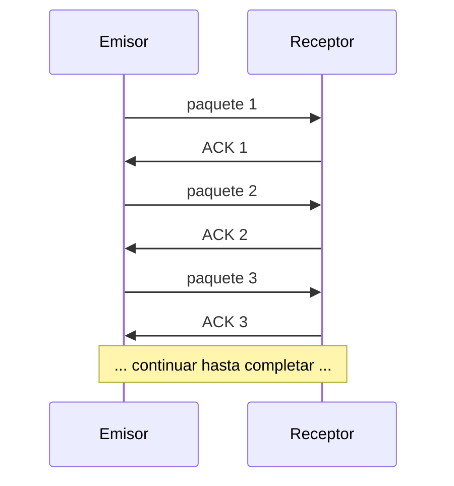
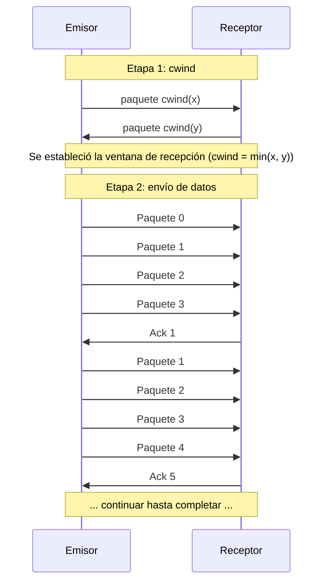

# Modelos de flujo - TP1 Redes

Modelos de flujo Cliente-Servidor general y de Upload/Download según `protocolo_udp_spec.md`.

---

## 1. Flujo inicial Cliente-Servidor

> El **cliente** elige el protocolo a utilizar (`SW` | `SR/SA`) al invocar el comando, mediante la opción `-r / --protocol` de upload/download.

---

### Handshake

Se plantean **dos variantes** de handshake. Cuál adoptar queda [**PENDIENTE: consultar al profesor**].

#### Handshake-v1

En esta versión se decide enviar primero el protocolo a utilizar, para la verificación que se pueda usar el mismo.

Luego se envía un paquete con un **Synchronizer** (SYN=1) para dar por finalizado el handshake y se puede comenzar a enviar los datos del archivo a transferir.

Se envía un paquete con la información del archivo a transferir, para que el servidor pueda validar si es posible realizar la transferencia. En caso de que no sea posible, se devuelve un error y se cierra la conexión.

Puntos de la v1:

1. **Paquete inicial**: el cliente manda **solo el protocolo** que quiere usar; el servidor verifica compatibilidad y responde `Handshake_ok / error`.
2. **`paquete_0`**: es donde se manda el **Método** (`upload` | `download`), el **filename** y (en upload) el **tamaño**.
3. **Validación por etapas**: primero el protocolo, y recién después la viabilidad de la transferencia.
4. **Ventaja**: si el protocolo no es compatible, el servidor no recibe metadatos del archivo (validación temprana y ligera).
5. **Desventaja**: más round-trips antes de poder transferir.

#### Handshake-v2

En esta versión se decide enviar la infomración completa del archivo a transferir en el handshake, para que el servidor pueda validar si es posible realizar la transferencia. En caso de que no sea posible, se devuelve un error y se cierra la conexión.

Al concentrar **todo en un único primer paquete** (`Protocolo + Método + filename + tamaño`), el handshake se resuelve con **un solo round-trip**: el servidor valida método, archivo y compatibilidad de protocolo en un solo `Handshake_ok / error`.

Puntos de la v2:

1. **Un único paquete** con toda la información del archivo y el protocolo a usar.
2. **Validación en un solo paso**: método, archivo y compatibilidad de protocolo se chequean juntos.
3. **Ventaja**: menos round-trips; no hay negociación previa.
4. **Desventaja**: los metadatos del archivo se envían completos aunque el protocolo no sea compatible.

> [**PENDIENTE — consultar al profesor**] ¿Qué versión de handshake adoptar? La **v1** valida por etapas (protocolo → archivo) con más round-trips; la **v2** valida todo en un solo intercambio.

---

## 2. Flujo del Protocolo de Stop-and-Wait

Puntos importantes del flujo de Stop-and-Wait *(regla de diseño del grupo)*:

1. Envía el paquete 1 y espera el ACK 1.
2. Si recibe el ACK 1, envía el paquete 2 y espera el ACK 2.
3. Si no recibe el ACK 1, reenvía el paquete 1 (hasta **3 intentos**, luego cierra la conexión).

Reglas de diseño (decisiones del grupo):

1. **Timeout**: `timeout_recepción >> timeout_emisor`, para que el receptor aguante los reintentos del emisor.
2. **Checksum**: si el receptor valida el checksum como **inválido**, **dropea el paquete** y espera el reenvío (no responde).
3. **ACK**: el emisor solo avanza cuando llega el **ACK esperado**; ante un ACK desordenado **no envía nada** y sigue esperando.

Dentro del paquete a enviar, se incluye un **checksum** para validar la **integridad** de los datos, y el **payload** del paquete puede ser de tamaño variable, dependiendo de la cantidad de datos a enviar.

---

## 3. Flujo del Protocolo de Selective ACK (Acknowledgment)

> Para el flujo se utilizará una `cwind = 4`

> El Ack 1 significa que el receptor recibió correctamente hasta el paquete 0 y quedo esperando el paquete 1. El receptor no envía un ACK por cada paquete recibido, sino que envía un ACK selectivo indicando hasta qué paquete recibió correctamente.

Elegimos el `min(x,y)` para establecer la ventana de recepción, ya que el **emisor puede enviar hasta x paquetes** y el **receptor puede recibir hasta y paquetes**. Por lo tanto, la ventana de recepción será el mínimo entre ambos valores.

Los paquetes que vayan llegando se irán almacenando en un buffer, y el receptor enviará un **ACK selectivo** hasta que paquete recibió correctamente, y el emisor enviará los paquetes desde el primer paquete no confirmado.

> [**PENDIENTE**] Criterio de reenvío del emisor en SR/SA: ¿cuándo reenviar un paquete que no fue confirmado?
> Opciones: **3 ACKs duplicados** (fast retransmit, como TCP) y/o **timeout del emisor**. Definir.
